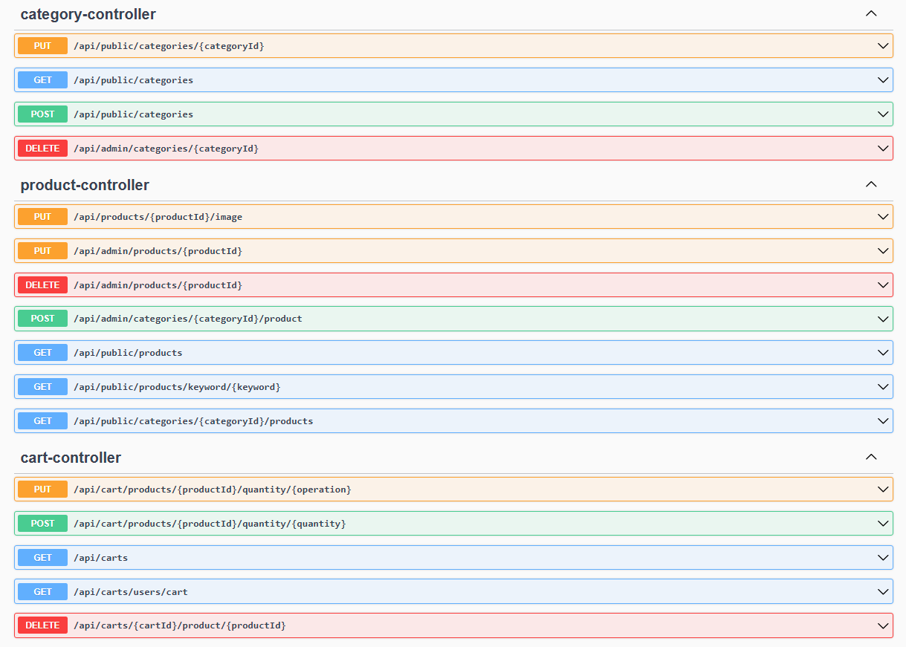
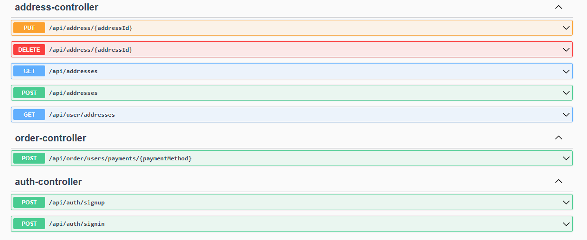
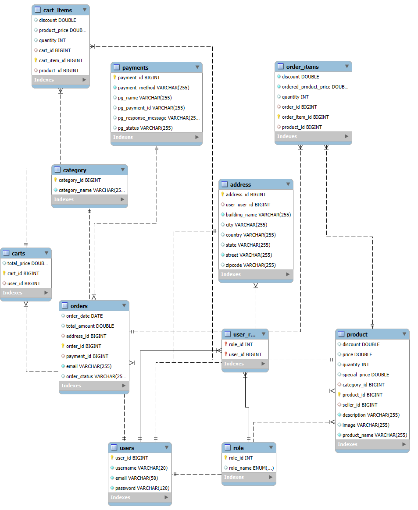

# E-Commerce Backend API

- This is a backend API designed for an e-commerce platform. It supports product management, user authentication, cart functionality, and payment integration using Stripe.

## Prerequisites
- Java 17 or higher
- Maven
- MySQL
- Stripe API Key
## How to Run
1. Clone the repository:
   ```bash
   git clone https://github.com/ahmed44374/API-sp-ecommery-

  ```
  cd Ecommercy-API
  ```


## Features
- User authentication with JWT
- Product management (CRUD operations)
- Cart and order management
- Stripe payment integration
- API documentation using Swagger
## Technologies Used
- Java 17
- Spring Boot
- MySQL
- Stripe API
- Swagger
- Lombok
- Model Mapper
- Jakson


## API Documentation (Swagger UI)
Below is a screenshot of the Swagger UI showcasing the API endpoints:






## ER Diagram
The Entity-Relationship (ER) Diagram for the database is shown below:


